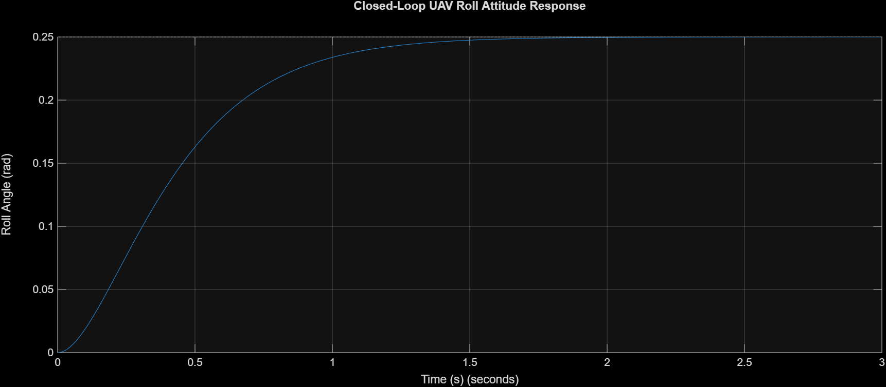
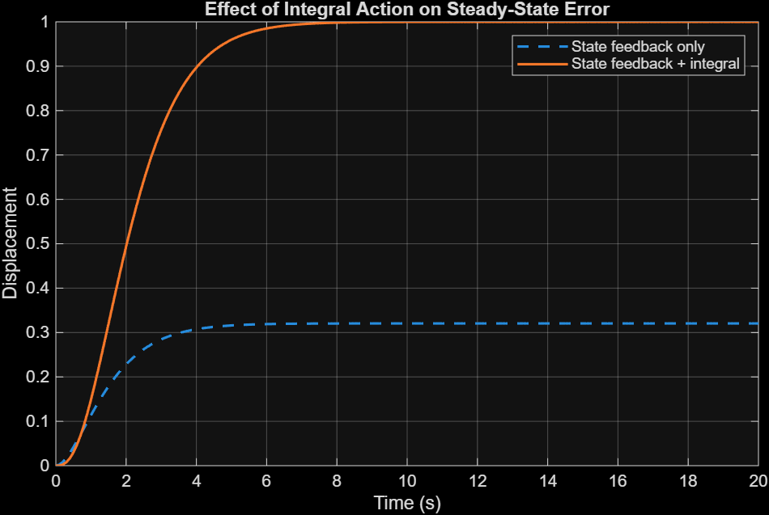
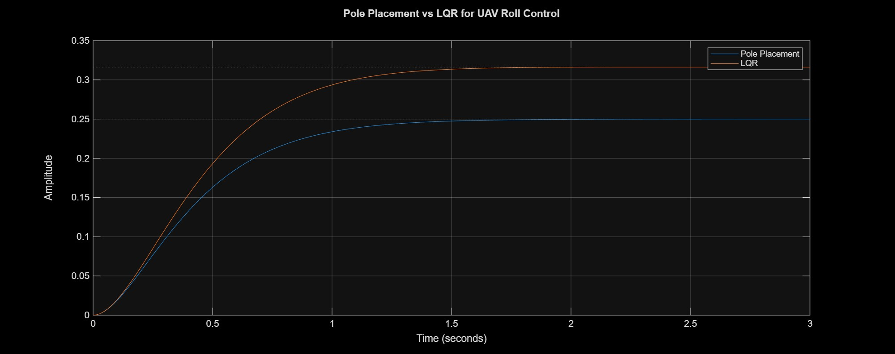
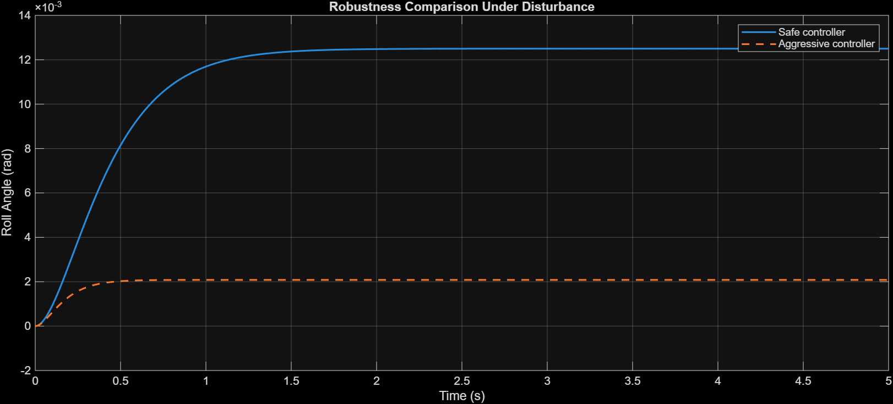

# UAV Roll Attitude Control

## 📌 Problem

Maintaining stable roll attitude is critical for drone flight.

This project focuses on stabilizing the roll axis of a UAV using different control strategies and analyzing their performance under disturbances.

---

## 🧠 System Overview

The roll dynamics of a UAV can be approximated as a second-order system:

- Input → control torque (from motors)  
- Output → roll angle  

Objective:
- Track desired roll angle  
- Reject disturbances  
- Achieve fast and stable response  

---

## ⚙️ System Model

The UAV roll axis is modeled as a second-order system:

- Input → control torque  
- Output → roll angle  

👉 This simplified model captures essential roll dynamics for controller design and analysis.

---

## 🧩 Control Strategies Implemented

This project explores multiple control techniques:

- PID-based roll control  
- State feedback with integral action  
- LQR control  
- Robustness and optimality analysis  

👉 Each method is implemented and compared on the same system.

---

## 📂 Project Structure
uav-roll-attitude-control/  

├── roll_attitude_control/  
├── state_feedback_integral/  
├── lqr_control/  
├── robustness_and_optimality/  


👉 Each folder represents a different control strategy.

---

## 📷 Results & Analysis

### 🔹 PID Control (Closed Loop)

<p align="center">
  
</p>

- Stabilizes roll angle  
- Reduces oscillations  
- Faster settling time  
- Tested under disturbance input  

👉 Provides stable roll control but requires tuning for optimal performance.

---

### 🔹 State Feedback + Integral Control

<p align="center">
  
</p>

- Eliminates steady-state error  
- Improves disturbance rejection  

👉 Combines stability with accuracy.

---

### 🔹 LQR Control

<p align="center">
  
</p>

- Optimized control effort  
- Smooth and efficient response  

👉 Provides optimal performance based on cost function.

---

### 🔹 Robustness Analysis

<p align="center">
  
</p>

- Evaluates system under parameter variations  
- Tests stability limits  

👉 Important for real-world reliability.

---

## 📊 Comparison Summary

| Method                  | Stability | Speed | Accuracy | Robustness |
|------------------------|----------|-------|----------|------------|
| PID                    | Good     | Medium| Medium   | Low        |
| State Feedback + Int   | Good     | Fast  | High     | Medium     |
| LQR                    | Excellent| Fast  | High     | High       |
| Robustness Analysis    | —        | —     | —        | Evaluated  |

---

## ▶️ How to Run

1. Open MATLAB  
2. Navigate to any control method folder  

```matlab
cd('roll_attitude_control')
```
---
###⚙️ What This Project Demonstrates
Control of a real-world dynamic system (UAV roll axis)
Comparison of classical and modern control methods
Trade-offs between performance and complexity
Effect of disturbances and system uncertainties
🛠 Tools Used
MATLAB
Control System Toolbox
---
###🎯 Conclusion

Different control strategies provide different levels of performance for UAV roll stabilization:

PID → simple and practical
State feedback → improved accuracy
LQR → optimal control
Robustness analysis → ensures reliability

👉 Selecting the right controller depends on system requirements and constraints.
